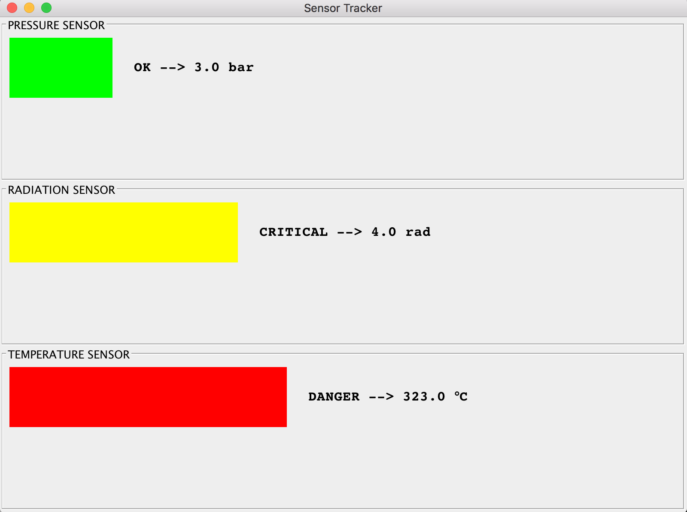

# Sensor
This application uses Java GUI to display sensor readings and status bars for temperature, pressure, and radiation. It uses Adaptor Design Pattern 
to display the sensor tracker given the sensor classes, which do not have a common supertype.

## Application Snapshot

